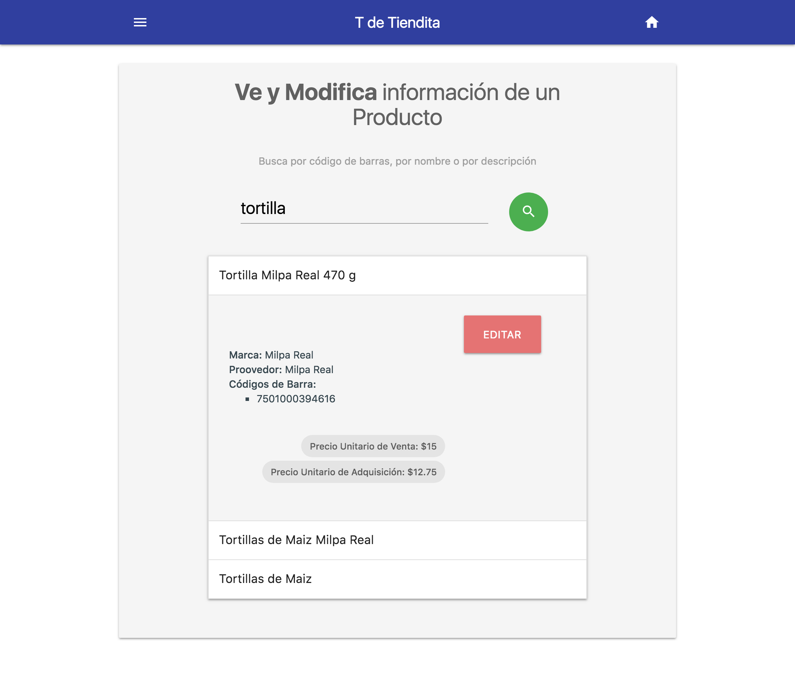

# T de Tiendita

## File Structure

* **Server:** Contains all the files that the back-end need
* **Static:** Contains all the files thtat use the front-end

## Technologies
### **Front-End**
* HTML5
* CSS3
    * MaterializeCSS 
* ReactJS
* npm
* webpack
* babel

### **Back-End**
* Python3.6
* Flask

## Characteristics

### Sales Page

- Autofocus in codebar
- If you put `$` then it will be render as a price or for example or 
`$10` means $10 of an item or like $10 of eggs and `10` is 10 items
- You can navigate through a sale with buttons or hot keys
- Is responsive, even on Mobile
- You can delete an item
- You have a ton of Hot Keys:
	- MoveFocusToRight: with `shift+right` or `alt+right` or `ctrl+right`
	- MoveFocusToLeft: with `shift+left` or `alt+left` or `ctrl+left`
    - SendProduct: with `enter`
    - MoveToRight: with `shift+right` or `alt+right` or `ctrl+right`
    - MoveToLeft: with `shift+left` or  `alt+left` or  `ctrl+left`
    - SetFocusToQuantity: with `f1` or `alt+1` or `shift+1`
    - SetFocusToBarCode:  with `f2` or `alt+2` or `shift+2`
    - SetFocusToSearch:   with `f3` or `alt+3` or `shift+3`
    - To close Dialogs use `esc`

